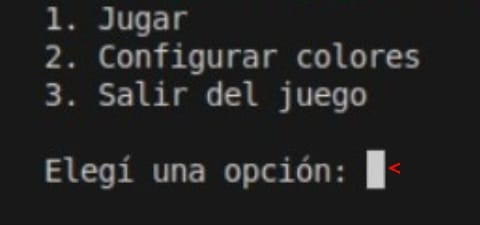

# Ajedrez 2024 - Juan Alejo Patiño

Este repositorio contiene un proyecto de ajedrez en Python, incluyendo funcionalidades completas y pruebas unitarias. A continuación, se detallan las instrucciones para poner en funcionamiento el proyecto utilizando Docker.

## Tutorial para Jugar

Al iniciar el cliente, lo primero que aparece en la terminal es el siguiente menú:



Este es el Menú Principal del juego. Ofrece tres opciones para jugar al ajedrez, configurar los colores de las piezas o salir del juego. Para elegir una opción, simplemente ingresá el número correspondiente. En caso de ingresar cualquier otra cosa (letras, números no válidos, etc.), el menú se repetirá hasta que se seleccione una opción válida.

Si elegís la opción 3. Salir del juego, el cliente finalizará su ejecución tras imprimir un mensaje indicándolo.


Si elegís la opción 2. Configurar colores, se mostrará un submenú para elegir entre tres pares de colores para personalizar las piezas que se usarán durante la partida de ajedrez. Este submenú te permitirá seleccionar uno de los tres pares de colores o volver al Menú Principal si preferís no cambiar los colores. Si elegís algún par de colores, el cliente volverá automáticamente al Menú Principal con un mensaje indicando los colores seleccionados.


A continuación, se muestran las tres opciones de colores para las piezas:

1. Blanco/Negro (La opción configurada por defecto)


2. Azul/Rojo


3. Amarillo/Morado


Finalmente, si elegís la opción 1. Jugar, comenzará la ejecución de una partida de ajedrez. Durante la partida, la terminal mostrará el tablero de ajedrez, un mensaje indicando de quién es el turno actual, y mensajes para que los usuarios interactúen con el juego.

Para jugar, debés ingresar los movimientos en notación algebraica (primero la letra que indica la columna y luego el número que indica la fila), que es la forma en que se registran las partidas de ajedrez. Por ejemplo, C2 -> C3 movería la pieza que se encuentra en la fila 2, columna C. Si el jugador se arrepiente de haber elegido una pieza para mover y quiere elegir otra, basta con dejar vacío el input para el mensaje 'Hacia casilla: '. Esto hará que el juego indique que no se ingresó un movimiento, reiniciando el turno del jugador.


Siguiendo las reglas del ajedrez, siempre comienzan jugando las BLANCAS. Tras hacer un movimiento, el turno siguiente será de las NEGRAS, y así sucesivamente.


Para finalizar el juego es necesario que ocurra una de las siguientes condiciones:

1. Captura de uno de los reyes, otorgando la victoria al otro color. Por ejemplo, la captura del rey de las BLANCAS otorgaría la victoria a las NEGRAS.

2. Que uno de los jugadores se quede sin piezas. Por ejemplo, si todas las piezas BLANCAS fueran capturadas, esto otorgaría la victoria a las NEGRAS.

3. Que ambos jugadores decidan finalizar la partida por acuerdo mutuo. Para solicitar el empate, cualquier jugador debe escribir la palabra 'empate' en el momento en que tiene que elegir la pieza que desea mover. Es decir, junto al mensaje 'Mover pieza desde: '. Al hacerlo, aparecerá una pregunta que ambos jugadores deben contestar obligatoriamente de forma afirmativa (con un 'Y') para indicar que están de acuerdo.


Si ingresan cualquier otra cosa, o alguno de ellos no quiere declarar empate, se mostrará un mensaje indicando que la partida debe continuar. Se puede solicitar el empate tantas veces como se desee, sin importar cuán avanzada esté la partida, siempre que se escriba 'empate' en el momento en que se elige la pieza que se quiere mover.


## Uso de Docker

### Construir la Imagen Docker

Para construir la imagen Docker para el proyecto:

1. Navegá a la raíz del repositorio.

2. Ejecutá el siguiente comando para construir la imagen Docker:
```sh
docker buildx build -t ajedrez-2024-juanalejop .
```

Para ejecutar el proyecto tanto en modo testing como desplegado, usar el siguiente comando:
```sh
docker run -it ajedrez-2024-juanalejop
```
IMPORTANTE: es crucial que no faltera la flag '-it' para el correcto funcionamiento de colorama durante la ejecución de la imagen Docker.

Esto mostrará un mensaje con el estado de los tests, y luego iniciará el cliente del juego a través de terminal.

# CircleCI

[](https://dl.circleci.com/status-badge/redirect/gh/um-computacion-tm/ajedrez-2024-JuanAlejoP/tree/main)

# CodeClimate

[](https://codeclimate.com/github/um-computacion-tm/ajedrez-2024-JuanAlejoP/maintainability)

# Test CodeClimate

[](https://codeclimate.com/github/um-computacion-tm/ajedrez-2024-JuanAlejoP/test_coverage)